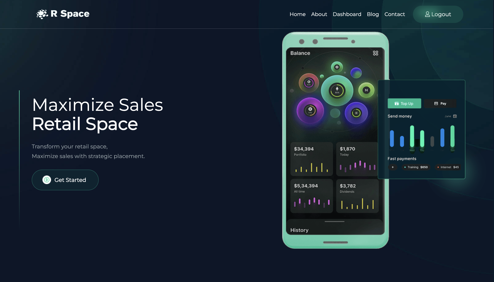
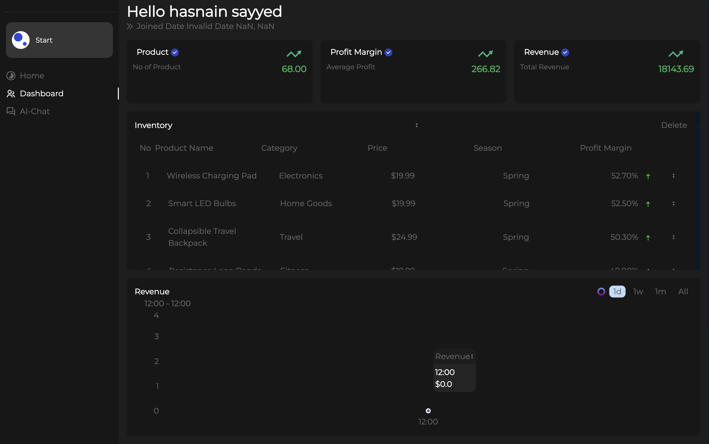
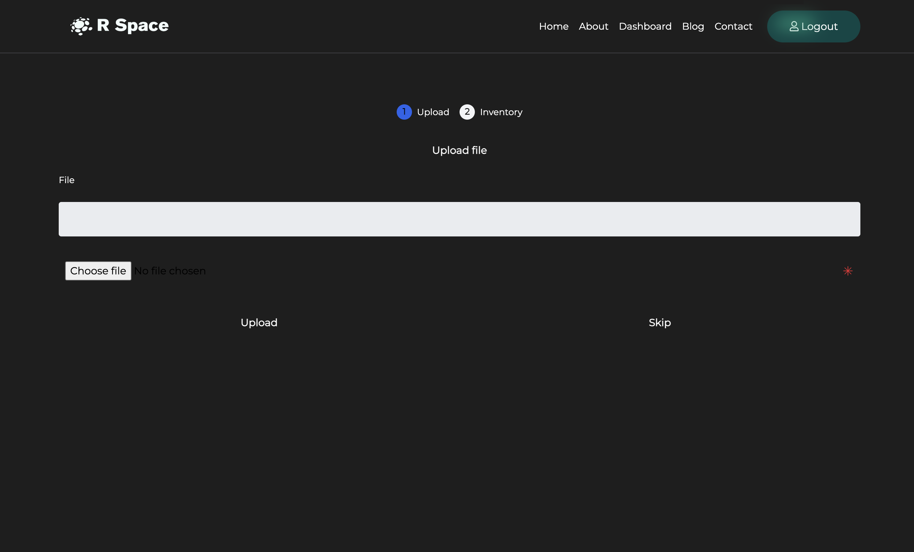
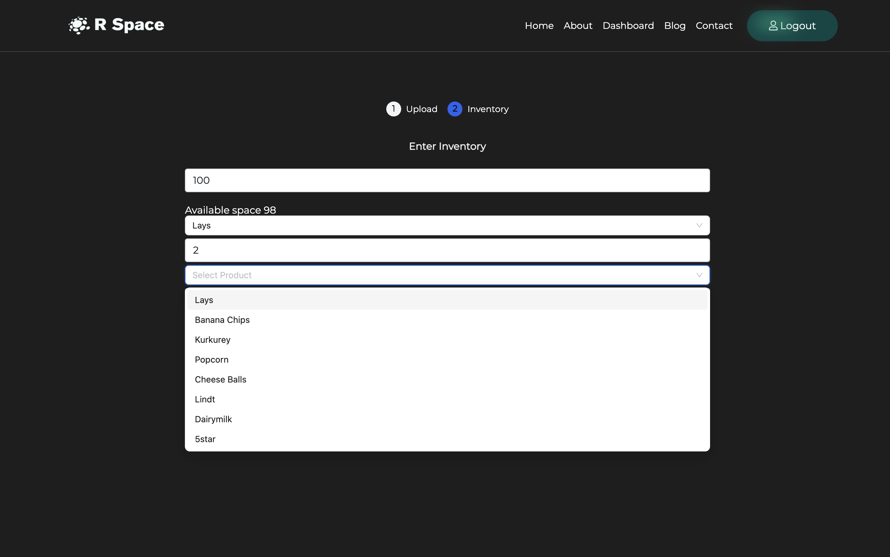
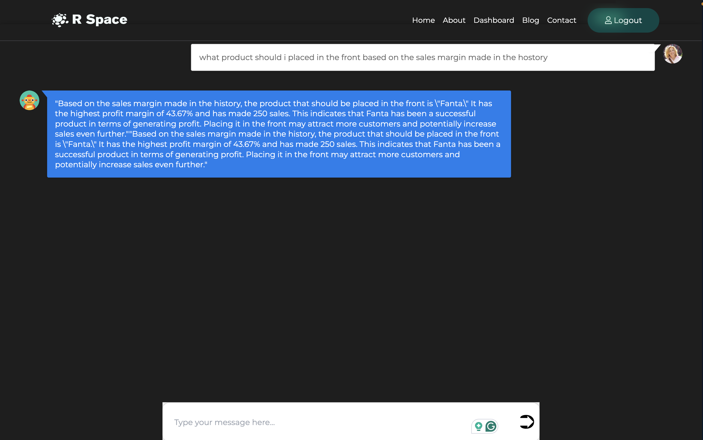

## Gpay Web App

## Description

The project provides innovative solution that transforms retail spaces by optimising product placement and store layouts using advanced technology. By strategically placing products, we boost engagement and sales, unlocking the full potential of underperforming areas for maximum profitability. Our system leverages data-driven insights from Langchain and Pinecone to analyze sales data and customer behavior, providing actionable recommendations. With real-time optimization via Firebase, store managers can implement changes instantly, while our user-friendly interface.

## Technology stack

1. NextJS
2. Langchain
3. Pinecone
4. Firebase
5. recharts

## Screenshots

